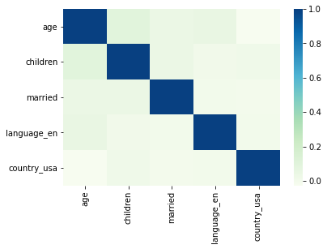
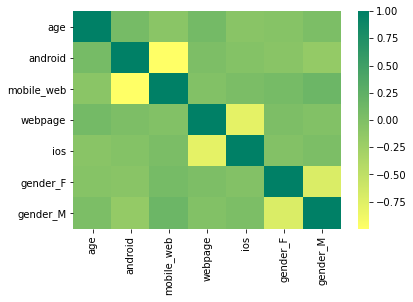

# Case study: Airbnb K-means clustering 
# Background 
Airbnb has a wide range of user travel scenarios around the world. 
It collects comprehensive user behavior data on its app, webpage and through various marketing channels. 
Through these data, it is of great importance of Airbnb develpment and it is the cornerstone to target potential target customer groups and formulate corresponding marketing strategies.

# Analysis goal 

Based on customer data and consuming behaviour data
* cluster group customers using jupyter notebook
* analyze core characteristics of customer groups through analyzing data 

# 1. Data analysis 
## Index explanation 
* id: user unique id 
* date_acc_reg: user registration date
* date_first_booking: Date of first booking
* gender
* age
* married
* children: number of children 
* ios: Booked on the iphone
* android: Booked on the Android
* mobile_web: Booked on the mobile
* web: Booked on the computer
* language_en: use English language 
* language_chn: use Chinese language 
* country_usa: destination is USA
* country_eur: destination is European countries

# 2. Univariate analysis

## 2.1 Handle exception of numerical variables 
Conclusion: The age of users ranges from 18 to 80, with an average age of 36 years old and a median age of 33 years old. Among them, users aged 28-32 are the main consumers.

## 2.2 Categorical variable
* 2.2.1 Adjust date variable 
- 1. extract user registration date and change its Dtype from object to datetime64
- 2. compute how many years the users have been registered 

Conslusion: 1. the minimum year length of registration is 7 years while the longest is 11 years.
2. the shortest time since the first booking is 6 years and the longest is 11 years

* 2.2.2 Adjust gender to be dummy variables 

# 3. Relevant and visualization

## 3.1 Observe the relationship between age and other users’ personal information
 

Conclusion: 
 - 1. The user’s age is positively correlated with the variables of language_en and children, indicating that Airbnb is more popular in families with higher age, higher frequency of using English and more children. 

- 2.  Age has a negative correlation with the country_usa variable, indicating that the greater the age of the user, the less likely they are to use Airbnb in USA. 

## 3.2 Observe the relationship between age and the user's ordering channel and gender
 

Conclusion: 
- 1. As age increases, users will be more inclined to order on the computers.
- 2. Elder users tend to order on android phones while younger users tend to order on iPhones.
- 3. Male users prefer to order on the webpages, and they don’t like to order on Android phones.
- 4. The correlation between age and the user's ordering channel and gender is too weak, which is of little significance for subsequent analysis.

# 4. Model establishment and evaluation
## 4.1 Establish model 

The selection is based on the user's behavioral preferences and consideration of the user's personal information
- variables of android, mobile_web, webpage, ios reflects the customer’s behavioral preferences
- age is the variable of user information 

## 4.2 Data visualization, view univariate dimensional analysis results

There are only two dimensions of 0 and 1 in ios, so its visualization is not good. 

## 4.3 Model evaluation 

- cluster 0 prefer order on webpage，less on android phoens. 
- cluster 2 prefer ios,very few order via webpage. 
## 4.4 Model optimization

- age tends to be elder 
- cluster 1 prefer order on webpage,less on android phoens.
- cluster 2 do not like order on webpages.
- cluster 3 prefer ios, very few order on webpages
- age of cluster 4 is eldest, and cluster 4 and 0 data distinction is very small, which is of little significance to actual analysis.

## 5 Summarize 
- Pay attention to the heavy Airbnb users who are 28-32 years old and registered year for 6-7 years, and develop corresponding marketing strategies for customers with low responsiveness. 

- The user’s age is positively correlated with the variables of language_en and children, indicating that Airbnb is more popular in families with higher age, higher frequency of using English and more children. 

- Age has a negative correlation with the country_usa variable, indicating that the greater the age of the user, the less likely they are to use Airbnb in USA. 

- As age increases, users will be more inclined to order on the computers.
- Elder users tend to order on android phones while younger users tend to order on iPhones.
- Male users prefer to order on the webpages, and they don’t like to order on Android phones.
- The correlation between age and the user's ordering channel and gender is too weak, which is of little significance for subsequent analysis.
